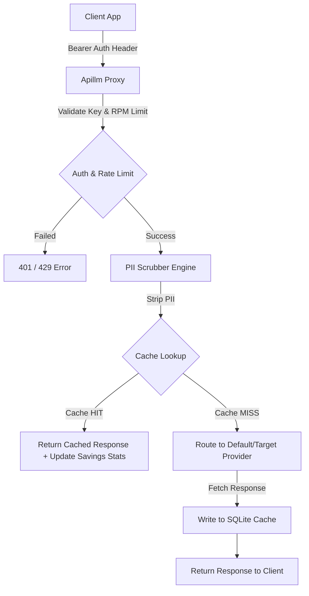
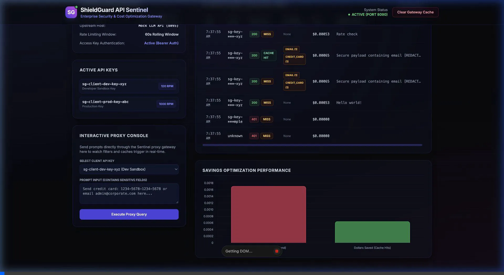
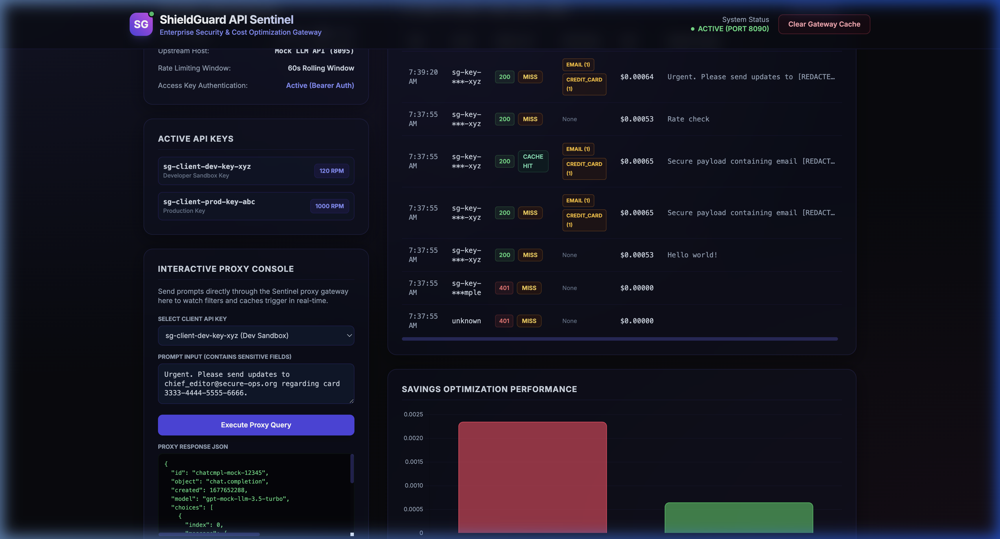

# **Apillm Gateway**

[](https://www.python.org/)
[](LICENSE)
[](https://github.com/)

**Apillm Gateway** (API LLM Gateway) is an enterprise-grade reverse proxy and cost control gateway designed for Large Language Model (LLM) APIs. It sits transparently between your application microservices and third-party LLM providers (e.g., OpenAI, Anthropic, Gemini) to enforce security policies and slash API consumption costs.

---

## **Key Features**

1. **Zero Data Leakage (PII Redaction)**: Scrutinizes inbound prompt requests using configurable regex patterns to strip out sensitive data (emails, credit card numbers, US SSNs, and cloud credentials/API tokens) prior to forwarding requests upstream.
2. **Direct Billing Optimization (SQLite Caching)**: High-speed caching saves outbound token billing on repeated prompt queries. Features dynamic whitespace/casing prompt normalization and configurable Time-to-Live (TTL) cache invalidation.
3. **Budget Governance (Access Control & Rate Limiting)**: Validates client identities via Bearer tokens and applies rolling rate limits to prevent runaway loops or developer budget overruns.
4. **Resilient Upstream Failover**: If the primary LLM provider fails, Apillm automatically reroutes queries to a designated fallback provider to guarantee service availability.
5. **Telemetry Dashboard**: A dark-theme, glassmorphic visual command center to monitor live cache hit ratios, token metrics, cost savings, and redact events in real-time. Includes an interactive testing console.

---

## **Architecture Workflow**



---

## **Telemetry Command Center UI**

Below is a live walkthrough and interface view of the Apillm Gateway admin dashboard during execution:

### **Live Interactive Walkthrough**
Here is a screen recording demonstrating real-time logs, security filter redactions, and cache hit metrics increments:



### **Visual Telemetry Overview**


---

## **Getting Started**

### **Prerequisites**
- **Python 3.10+** (Recommended)
- **pip** package installer

### **Quickstart Setup**
The simplest way to spin up the entire Apillm ecosystem is using the auto-setup launcher script. This script automatically handles Python virtual environment creation, dependencies installation (FastAPI, Uvicorn, Requests), and launches both the gateway and a mock LLM provider:

```bash
# Clone the repository (or copy folders)
cd apillm-gateway

# Start servers
python3 run.py
```

Upon a successful launch, you will see output like:
```text
============================================================
 Apillm Gateway Sentinel is fully operational!
  - Gateway Endpoint:  http://127.0.0.1:8090/v1/chat/completions
  - Admin Dashboard:   http://127.0.0.1:8090/dashboard
  - Upstream Provider: http://127.0.0.1:8095/v1/chat/completions
============================================================
```

To view metrics, navigate your browser to **[http://127.0.0.1:8090/dashboard](http://127.0.0.1:8090/dashboard)**.

---

## **Running Integration Tests**

We provide an automated verification suite to test authorization, PII filtering, caching, rate-limit headers, upstream failovers, and telemetry API:

```bash
# Run tests inside the virtualenv environment
.venv/bin/python test_suite.py
```

---

## **Enterprise Integration & Deployment Guide**

Integrating Apillm Gateway into a corporate organization follows this structured sequence:

### **Step 1: Containerization**
Build the Apillm container image locally or deploy it to a private container registry (e.g., AWS ECR or Docker Hub):

```bash
# Build the Docker image
docker build -t apillm-gateway:latest .

# Run the container locally
docker run -d -p 8090:8090 \
  -v $(pwd)/config.json:/app/config.json \
  -v $(pwd)/apillm_cache.db:/app/apillm_cache.db \
  apillm-gateway:latest
```

### **Step 2: Deployment Topologies**
- **Central API Gateway (Recommended)**: Deploy Apillm in a central cluster (e.g. AWS EKS) and assign an internal DNS domain name like `apillm.internal.company.com`. All corporate microservices target this central endpoint.
- **Sidecar Pattern (Kubernetes)**: Run the Apillm Gateway as a sidecar container inside the same pod as your LLM consuming microservice. Direct the microservice's SDK to `localhost:8090`.

### **Step 3: Secure Upstream Configurations**
Instead of hardcoding API keys in `config.json`, configure the upstream settings using environmental variables injected by Kubernetes Secrets or HashiCorp Vault. Update the proxy to load upstream keys using environment variable strings.

### **Step 4: Client Code Integration**
Apillm matches standard OpenAI SDK expectations. Developers configure their LLM libraries to query the proxy gateway URL using the client key mapped to their microservice:

#### **Python (OpenAI SDK)**
```python
from openai import OpenAI

client = OpenAI(
    base_url="http://apillm.internal.company.com:8090/v1",
    api_key="sg-client-dev-key-xyz" # Mapped in config.json
)

response = client.chat.completions.create(
    model="gpt-4",
    messages=[{"role": "user", "content": "Query payload here..."}]
)
```

#### **Node.js (OpenAI SDK)**
```javascript
const { OpenAI } = require("openai");

const openai = new OpenAI({
  baseURL: "http://apillm.internal.company.com:8090/v1",
  apiKey: "sg-client-dev-key-xyz"
});
```

### **Step 5: Audit Log Monitoring & SIEM Ingestion**
The gateway writes structured JSON logs into `apillm_audit.jsonl`.
- Set up a log collector agent (like Vector, Datadog Agent, or FluentBit) to tail the audit log file.
- Forward logs to your company's central SIEM/monitoring service (e.g., Splunk, Elasticsearch, Datadog, or Grafana Loki).
- Build alerts based on HTTP status 429 triggers (developer API abuse) or high rates of PII redactions.

---

## **Configuration Guide (`config.json`)**

You can customize the proxy ports, providers, API keys, rate limits, and custom redact patterns directly in `config.json`:

```json
{
  "proxy": {
    "host": "127.0.0.1",
    "port": 8090,
    "dashboard_enabled": true
  },
  "upstream": {
    "default_provider": "mock-api",
    "fallback_provider": "mock-api",
    "providers": {
      "mock-api": {
        "url": "http://127.0.0.1:8095/v1/chat/completions",
        "api_key": "mock-key-123"
      }
    }
  },
  "caching": {
    "enabled": true,
    "type": "sqlite",
    "database_path": "apillm_cache.db",
    "ttl_seconds": 3600
  },
  "security": {
    "redaction_enabled": true,
    "redact_replacement": "[REDACTED_{rule_name}]",
    "rules": [
      {
        "name": "EMAIL",
        "pattern": "[a-zA-Z0-9_.+-]+@[a-zA-Z0-9-]+\\.[a-zA-Z0-9-.]+",
        "enabled": true
      }
    ]
  }
}
```

- **`upstream.providers`**: Map target LLM endpoints (e.g. OpenAI production urls) and configure their outbound API authentication keys.
- **`security.rules`**: Define custom regular expressions to match sensitive identifiers. Any matched text will be scrubbed prior to leaving the gateway.

---

## **License**

Distributed under the MIT License. See [LICENSE](LICENSE) for more details.
